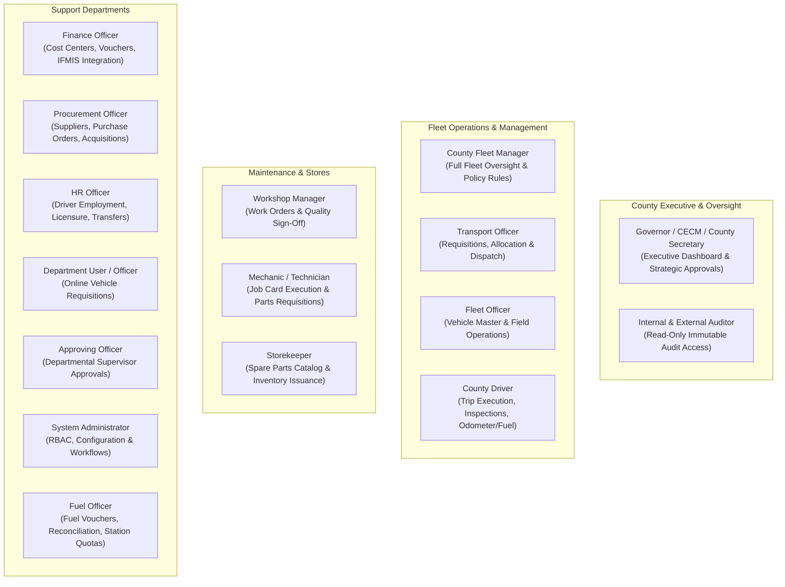
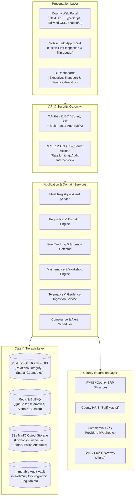
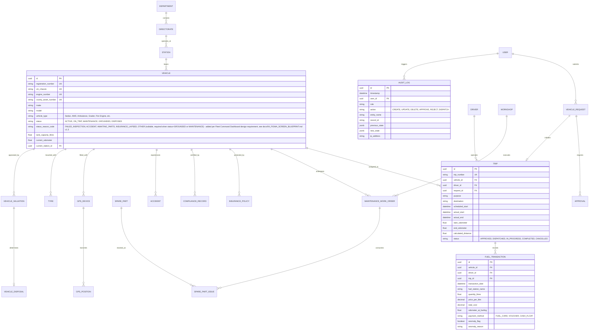
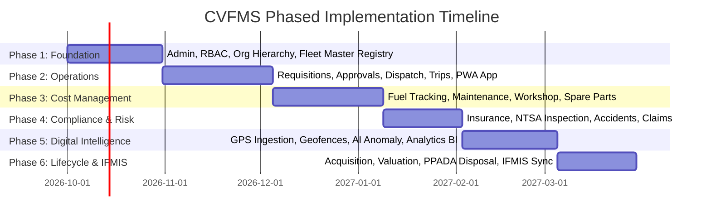

# County Government Vehicle Fleet Management System (CVFMS)
## Architecture, System Summary & Implementation Blueprint

---

**Document Reference:** CVFMS-ARCH-SUMMARY-V1  
**Based on:** Software Requirements Specification (SRS) v1.0  
**Target Environment:** Kenya County Governments (47 Counties)  
**System Type:** Web-based Enterprise Fleet & Plant Equipment Management Platform  
**Deployment Models:** Cloud / County Data Centre / Hybrid  
**Status:** Architecture & Executive Summary  

---

## 1. Executive Summary & Kenyan Public-Sector Context

The **County Government Vehicle Fleet Management System (CVFMS)** is an integrated enterprise platform designed to govern the full lifecycle of county vehicles, plant machinery, and specialized assets across all devolved sectors (Health, Public Works, Agriculture, Environment, Administration, Emergency Services, and the Governor’s Office).

### 1.1 Strategic Imperatives in Kenyan Devolution
* **Auditor-General & Statutory Audit Compliance:** Delivers an immutable, tamper-proof audit trail capturing every trip authorization, fuel expenditure, repair approval, and asset disposal in accordance with the **Public Finance Management (PFM) Act 2012** and **Public Procurement and Asset Disposal Act (PPADA) 2015**.
* **Financial & IFMIS Alignment:** Standardizes fleet cost centers, commitment accounting, and payment workflows to interface seamlessly with the **Integrated Financial Management Information System (IFMIS)** and county treasury systems.
* **Leakage & Fraud Eradication:** Addresses systemic public-fleet vulnerabilities: ghost trips, unapproved after-hours journeys, fuel siphoning, fueling outside assigned quotas or tank capacities, odometer rollbacks, and duplicate repair billings.
* **County Plant & Equipment Extensibility:** While providing standard motor vehicle management, the core domain model extends directly to heavy earthmovers (graders, excavators, rollers), emergency response units (fire engines, ambulances), and agricultural machinery (tractors, water bowsers).

---

## 2. System Scope & Complete Lifecycle Management

The CVFMS governs the asset lifecycle across twelve interconnected phases:

$$\text{Planning} \longrightarrow \text{Acquisition} \longrightarrow \text{Registration} \longrightarrow \text{Allocation} \longrightarrow \text{Dispatch} \longrightarrow \text{Utilization} \longrightarrow \text{Fuel} \longrightarrow \text{Maintenance} \longrightarrow \text{Compliance} \longrightarrow \text{Monitoring} \longrightarrow \text{Valuation} \longrightarrow \text{Disposal}$$

### 2.1 Core Functional Modules Matrix

| Module | Primary Scope & Public-Sector Functions |
| :--- | :--- |
| **Fleet Registry** | Vehicle master register, engine/chassis VIN, county asset barcodes, technical specs, logbooks, status tracking (*Active, Assigned, On Trip, Grounded, Maintenance, Awaiting Disposal*). |
| **Vehicle Allocation** | Assignments to County Departments, Directorates, Sub-Counties, Ward Offices, and specific departmental custodians. |
| **Requisition & Requests** | Electronic vehicle requisitions with travel justifications, passenger manifests, activity codes, and supervisor approvals. |
| **Dispatch Management** | Multi-point pre-dispatch validation checks (valid insurance, roadworthiness, driver licensing, safety equipment) with authorized executive override controls. |
| **Trip & Journey Logs** | Route scheduling, starting/ending odometer capture, calculated net distance, route geofencing, and trip closure reconciliation. |
| **Driver Management** | Complete personnel profiles, NTSA driving license classes, expiry tracking, medical/fitness assessments, driving record, and violation logs. |
| **Fuel Management** | Fuel card / voucher transactions, fuel station logging, unit pricing, automated $L/100\text{km}$ consumption calculations, and anti-theft anomaly detection. |
| **Maintenance Management**| Preventive maintenance scheduling (mileage/time/engine-hour triggers), corrective repairs, defect reporting, and warranty tracking. |
| **Workshop Management** | Internal county workshop job cards, technician/mechanic assignments, labor tracking, quality inspections, and vehicle release authorizations. |
| **Spare Parts & Inventory**| Spare parts catalogue, reorder thresholds, inventory receipts/issues linked directly to maintenance work orders. |
| **Tyre Management** | Serialized tyre lifecycle tracking (position, tread depth, mounting/dismounting mileage, replacement reasons). |
| **Insurance & Claims** | Policy registration, premium schedules, automated renewal lead-time alerts, accident claim tracking, and underwriter settlements. |
| **Statutory Compliance** | NTSA inspection certificates, speed governor calibration, PSV/commercial permits, and county operating licenses. |
| **Accident & Incidents** | Incident logging, police abstract references, scene photos, witness statements, third-party details, damage assessments, and board of inquiry workflows. |
| **GPS & Telematics** | Real-time tracking, breadcrumb history, speed violation alarms, geofencing, after-hours movement alerts, and engine idling diagnostics. |
| **Cost & BI Analytics** | Operating cost per kilometer, Total Cost of Ownership (TCO), budget vs. actual expenditure, executive dashboards, and exportable audit reports. |
| **Procurement & Disposal**| Acquisition logs, supplier contracts, board of survey valuations, auction management, and asset deregistration under PPADA regulations. |
| **Administration & Audit** | Role-Based Access Control (RBAC), organization hierarchy management, and an immutable system audit trail. |

---

## 3. Stakeholders & Role-Based Access Control (RBAC)

The system provides 16 discrete functional roles to enforce strict segregation of duties (maker-checker principle):



---

## 4. Recommended System Architecture & Technology Stack



### 4.1 Technology Stack Selection Rationale

1. **Frontend (Next.js 15, TypeScript, Tailwind CSS, Lucide):**
   * High performance, server-side rendering for complex fleet data grids.
   * Responsive layout optimized for desktop transport desks, workshop terminals, and tablet field inspections.
2. **Database Engine (PostgreSQL + PostGIS):**
   * ACID compliance required for public sector accounting and financial reconciliations.
   * PostGIS enables native spatial calculations for geofencing, sub-county boundaries, and route deviations.
3. **ORM & Migrations (Prisma ORM):**
   * Strong type safety, auto-generated TypeScript clients, and reproducible schema migrations across county data centers.
4. **Asynchronous Processing (Redis + BullMQ):**
   * Ingests streaming vehicle GPS breadcrumbs without blocking UI transactions.
   * Automated cron workers trigger compliance notifications (30-day, 14-day, 7-day warnings for insurance/inspection expiry).
5. **Mobile Strategy (Progressive Web Application - PWA):**
   * Zero-installation deployment for county-issued smartphones.
   * Local caching using IndexedDB allows drivers to log pre-trip checklists and odometer readings even in low-connectivity rural sub-counties, syncing when connection restores.

---

## 5. Core Entity Relationship Model (Domain Entities)

Directly mapped from **SRS Section 20**:



---

## 6. Business Rules & Fraud Prevention Framework

The platform implements programmatic gates enforcing **SRS Section 18 (Business Rules)** and **Section 23 (Fraud & Control Management)**:

```
[Vehicle Requisition]
         │
         ▼
[Supervisor Approval] ──► (Reject / Return for Correction)
         │
         ▼
[Transport Review & Allocation]
         │
   ┌─────┴──────────────────────────────────────────────────────┐
   │                  MANDATORY DISPATCH GATES                  │
   ├────────────────────────────────────────────────────────────┤
   │ [BR-001] Insurance valid?           (NO ──► BLOCK DISPATCH)│
   │ [BR-002] Driver active & employed?  (NO ──► BLOCK DISPATCH)│
   │ [BR-003] Driver license valid?      (NO ──► BLOCK DISPATCH)│
   │ [BR-004] Vehicle not grounded/serv? (NO ──► BLOCK DISPATCH)│
   │ [BR-005] Official request linked?   (NO ──► BLOCK DISPATCH)│
   └─────┬──────────────────────────────────────────────────────┘
         │ (All Pass OR Authorized Executive Override with Justification)
         ▼
[Dispatch Authorized] ──► [Trip Initiated] ──► [Odometer & GPS Monitoring]
```

### 6.1 Programmatic Anti-Fraud Automated Controls
1. **Tank Capacity Boundary Gate:**
   $$\text{Fueling Volume} \le \text{Configured Vehicle Tank Capacity} \times 1.05$$
   Any fuel entry exceeding this threshold is rejected or flagged as a critical anomaly (indicates off-vehicle containers being filled).
2. **Odometer Monotonicity Rule (BR-007):**
   $$\text{New Odometer} \ge \text{Last Recorded Odometer}$$
   Any decrement triggers an **Odometer Rollback Investigation Alert** and requires mechanical verification.
3. **Ghost Trip Prevention:**
   Every fuel transaction and trip must link to an approved requisition and active driver. Standalone fuel receipts cannot be settled by Finance without an authenticated trip ticket.
4. **Rapid Consecutive Refueling Detection:**
   Flags duplicate fueling transactions logged within a 4-hour window unless mileage difference confirms proportional consumption.
5. **Consumption Outlier Detection:**
   $$\text{Calculated Efficiency} = \frac{\Delta \text{Kilometers}}{\text{Litres Refueled}}$$
   If efficiency deviates by more than $\pm 25\%$ from manufacturer / vehicle class baselines, a **Fuel Consumption Anomaly Work Order** is generated.

---

## 7. County Governance, Reporting & BI Analytics

The system outputs three specialized analytics dashboards and 18 standard reports conforming to **SRS Sections 6 & 7**:

### 7.1 Dashboard Tiering
* **Executive Dashboard (Governor, CECM, Chief Officer):**
  * Total County Fleet Size & Operational Availability Rate ($\ge 85\%$).
  * Total Monthly Fleet Expenditure (Fuel, Repairs, Insurance, Tyres).
  * Departmental fleet utilization benchmarks & idle asset identification.
  * Accident summary and ongoing liability exposure.
* **Fleet Manager Operational Dashboard:**
  * Real-time vehicle status breakdown (*Available, On Trip, Workshop, Grounded*).
  * Active requisitions awaiting allocation and vehicles due for return.
  * Preventive maintenance countdowns (km / date thresholds).
  * GPS speeding and after-hours travel alerts.
* **Finance & Audit Dashboard:**
  * Budget vs. Actual Fleet Expenditure by Department and Cost Center.
  * Fuel expenditure reconciliation by fuel card / supplier.
  * Workshop invoice approvals and pending payments.
  * Complete, non-editable audit trail log viewer.

---

## 8. Implementation Roadmap (Phases 1–6)

Following **SRS Section 21**, the system will be deployed across six structured milestones:



| Phase | Core Deliverables | Success Criteria |
| :--- | :--- | :--- |
| **Phase 1: Foundation** | Fleet Master Registry, County Hierarchy (Departments/Sub-Counties), RBAC Roles, User Management. | Complete vehicle register digitized; asset codes assigned; users authenticate with correct role rights. |
| **Phase 2: Operations** | Online Requisition workflow, Supervisor Approvals, Transport Review, Dispatch Gate, Trip logging, Driver mobile PWA. | End-to-end trip authorization workflow tested; pre-trip checklists captured; zero unauthorized dispatches. |
| **Phase 3: Cost Management** | Fuel tracking, Tank capacity validations, Workshop work orders, Spare parts store inventory, Tyre serial tracking. | Fuel reconciliations automated; work orders linked to asset costs; spare parts consumption tracked. |
| **Phase 4: Compliance & Risk**| Insurance policy management, NTSA inspection tracker, Renewal alert engine, Accident investigation & claim logs. | Expiry notifications sent 30/14/7 days prior; no un-inspected or uninsured vehicles dispatched. |
| **Phase 5: Digital Intelligence**| GPS provider API webhooks, live map tracking, geofence violations, fuel anomaly detection, Executive/BI dashboards. | Real-time vehicle positions displayed; off-route and after-hours alerts generated in real-time. |
| **Phase 6: Lifecycle & Integration**| Acquisition records, Board of Survey valuation, PPADA disposal auctions, IFMIS commitment/payment sync. | Full vehicle lifecycle cost (TCO) calculated; compliant asset retirement workflow enabled. |

---

## 9. Recommended Next Engineering Actions

To commence development immediately:

1. **Step 1: Application Scaffolding & Core Architecture Setup**
   * Initialize a Next.js (TypeScript) monorepo structure.
   * Configure Tailwind CSS and UI components.
   * Configure PostgreSQL with Prisma ORM and seed scripts.
2. **Step 2: Database Schema Implementation**
   * Write the complete Prisma schema representing all 30 core entities, relational foreign keys, enums, and indexes.
3. **Step 3: Phase 1 Prototype & Fleet Master Register**
   * Implement vehicle CRUD, department/station assignments, and role-based login interfaces for County users.

